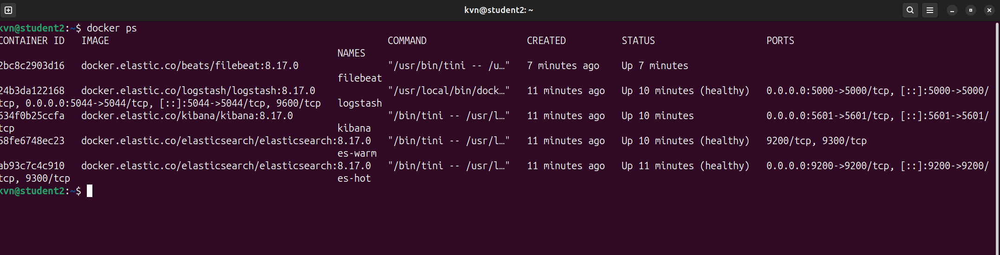
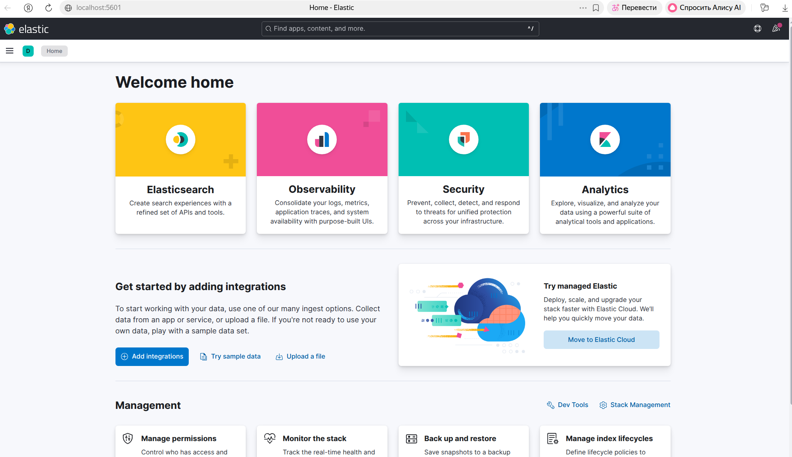
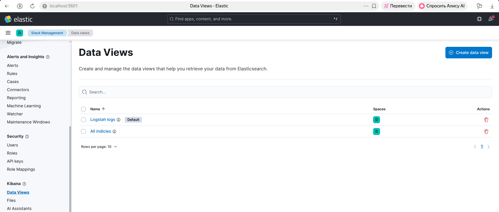
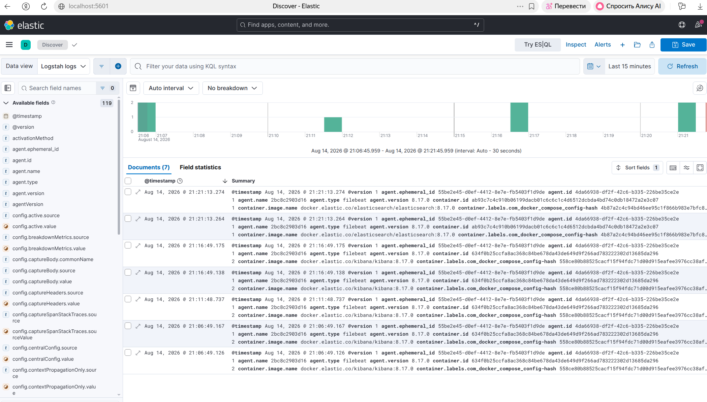

# Домашнее задание: система сбора логов Elastic Stack

Материалы:
- стек — `docker-compose.yml` (без каталога `help`)
- Elasticsearch — `elasticsearch/`
- Logstash — `logstash/`
- Kibana — `kibana/`
- Filebeat — `filebeat/`
- генератор событий (необязательно) — `dummy/`
- скриншоты — `screenshots/`
- текст задания — `READMEDZ.md`

Версия образов: Elastic Stack **8.17.0**. Учётные записи и TLS отключены: это локальный учебный стенд, секретов в репозитории нет.

## Запуск

На хосте Linux один раз (иначе Elasticsearch не стартует):

```bash
sudo sysctl -w vm.max_map_count=262144
```

Чтобы значение сохранилось после перезагрузки, добавьте в `/etc/sysctl.conf`:

```text
vm.max_map_count=262144
```

Запуск пяти контейнеров:

```bash
docker compose up -d
```

Проверка через несколько минут:

```bash
docker ps
curl -s http://localhost:9200/_cat/nodes?v
curl -s http://localhost:9200/_cat/indices?v
curl -s http://localhost:9200/_cluster/health?pretty
```

| Сервис | Адрес |
|---|---|
| Elasticsearch (hot, HTTP) | http://localhost:9200 |
| Kibana | http://localhost:5601 |
| Logstash, протокол Beats | `localhost:5044` |
| Logstash, JSON по TCP | `localhost:5000` |

Остановка: `docker compose down`.  
Тома с данными: `docker compose down -v`.

Индекс `logstash-*` появляется после того, как Filebeat начнёт читать журналы Docker и Logstash запишет их в Elasticsearch. Журналов стека достаточно. Для отдельных JSON-событий:

```bash
docker compose --profile demo up -d
```

Либо одна строка с хоста:

```bash
echo '{"app":"manual","event":"ping","message":"hello"}' | nc -w 2 127.0.0.1 5000
```

---

## Задание 1

### Вопрос

Поднять в Docker и связать между собой:

- Elasticsearch (узлы hot и warm);
- Logstash;
- Kibana;
- Filebeat.

Logstash — приём JSON по TCP.  
Filebeat — журналы Docker хоста в Logstash.

Результат: скриншот `docker ps` спустя 5 минут (пять контейнеров), скриншот Kibana, манифест Compose и YAML-конфигурации.

### Ответ

Каталог `help` не использовался. Стек описан своими файлами.

Пять контейнеров:

| Контейнер | Роль |
|---|---|
| `es-hot` | Elasticsearch: master, hot, content, ingest |
| `es-warm` | Elasticsearch: только уровень warm |
| `logstash` | приём Beats и JSON по TCP, индекс `logstash-%{+YYYY.MM.dd}` |
| `kibana` | интерфейс к HTTP API `es-hot:9200` |
| `filebeat` | чтение `/var/lib/docker/containers/*/*.log`, отправка в Logstash `:5044` |

Цепочка:

```text
журналы Docker
    → Filebeat (filestream + метаданные контейнера)
    → Logstash :5044 (Beats)
    → Elasticsearch es-hot (индекс logstash-ГГГГ.ММ.ДД)
    → Kibana Discover

JSON по TCP :5000
    → Logstash (codec json_lines)
    → тот же индекс logstash-*
```

Конфигурации:

- [`docker-compose.yml`](docker-compose.yml)
- [`elasticsearch/hot.yml`](elasticsearch/hot.yml)
- [`elasticsearch/warm.yml`](elasticsearch/warm.yml)
- [`logstash/logstash.yml`](logstash/logstash.yml)
- [`logstash/pipeline/logstash.conf`](logstash/pipeline/logstash.conf)
- [`kibana/kibana.yml`](kibana/kibana.yml)
- [`filebeat/filebeat.yml`](filebeat/filebeat.yml)

Logstash принимает JSON по TCP на порту **5000** (`codec => json_lines`).  
Параллельно открыт вход Beats на **5044**: Filebeat передаёт события именно этим протоколом, а не «сырым» JSON.

Проверка кластера после старта:

```bash
curl -s http://localhost:9200/_cat/nodes?v
```

Ожидаются две строки: `es-hot` с ролями `cdfhimr` (или набор `data_hot`, `data_content`, `ingest`, `master`) и `es-warm` с `data_warm`.

Kibana: http://localhost:5601 — вход без пароля.





---

## Задание 2

### Вопрос

Создать несколько index-patterns в Kibana, открыть Discover и разобрать поиск по журналам. Индекс `logstash-*` должен появиться из событий, которые Filebeat забирает из stdout контейнеров.

### Ответ

Страница создания шаблона (в 8.x раздел называется Data Views, адрес тот же):

http://localhost:5601/app/management/kibana/indexPatterns/create

Либо: **Stack Management → Data Views → Create data view**.

Шаблоны по имеющимся индексам:

| Имя | Шаблон | Поле времени |
|---|---|---|
| Logstash logs | `logstash-*` | `@timestamp` |
| Все индексы стека | `*` | `@timestamp` (если предлагается) |

Системные индексы `.kibana*`, `.internal*` для разбора журналов приложения не нужны.

Discover: **Analytics → Discover**, выбрать Data View `logstash-*`.

Что смотреть:

- `@timestamp` — время события;
- `message` — исходная строка журнала;
- `container.name` / `docker.container.name` — какой контейнер написал строку;
- `event`, `app`, `value` — поля JSON, если запускали `dummy` или отправили строку на порт 5000.

Поиск в строке KQL:

```text
container.name: kibana
message: *error*
app: dummy
```

Если индекса `logstash-*` нет:

1. `docker logs filebeat --tail 80` — видит ли Filebeat файлы журналов и Logstash.
2. `docker logs logstash --tail 80` — открыты ли порты 5000 и 5044, есть ли ошибки записи в Elasticsearch.
3. `curl -s http://localhost:9200/_cat/indices?v` — появился ли индекс.
4. Проверить том `/var/lib/docker/containers` у Filebeat и драйвер журналов Docker (`json-file` или `local`).





---

## Конфигурации решения

| Файл | Назначение |
|---|---|
| `docker-compose.yml` | пять сервисов, сеть `elastic`, тома данных |
| `elasticsearch/hot.yml` | кластер `monlog3`, роли hot/content/ingest/master |
| `elasticsearch/warm.yml` | тот же кластер, роль `data_warm` |
| `logstash/logstash.yml` | HTTP API, без мониторинга X-Pack |
| `logstash/pipeline/logstash.conf` | входы TCP JSON и Beats, выход в `logstash-*` |
| `kibana/kibana.yml` | `elasticsearch.hosts: http://es-hot:9200` |
| `filebeat/filebeat.yml` | журналы Docker → `logstash:5044` |
| `dummy/generate.py` | необязательные JSON-события (профиль `demo`) |
